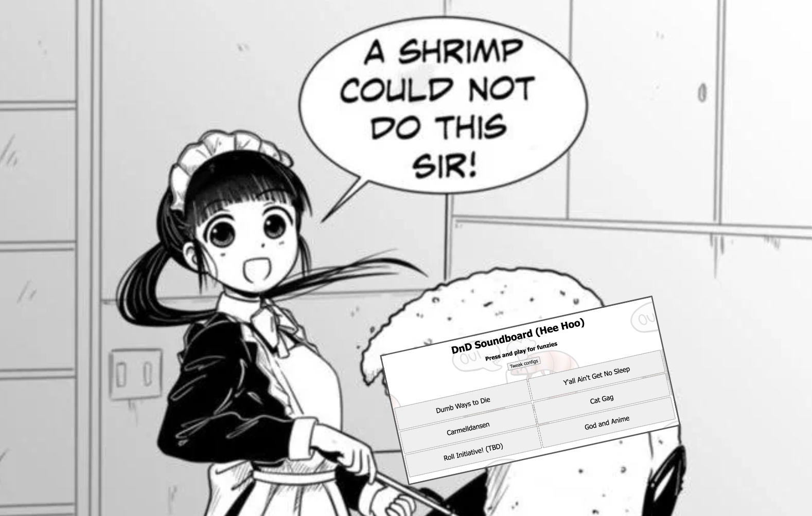

# Soundboard for DnD

This is more or ~~less~~ (very much so) a meme project.



Short project for setting up a soundboard to make playing meme soundbites easier during Dnd. Run the webserver from `soundboard_ui.py` to get it up and running.

Basic format for raw adding new files is as follows:
```
"id_string": 
    {"url": "yt_link", 
    "ts": 10.0, 
    "clip_duration": 5.0, 
    "name": "ID String", 
    "volume": 0.8}
```
YT shorts not supported. When using the config UI, `id_string` will be taken from `name`.

Editing of existing file functionality TBA.
